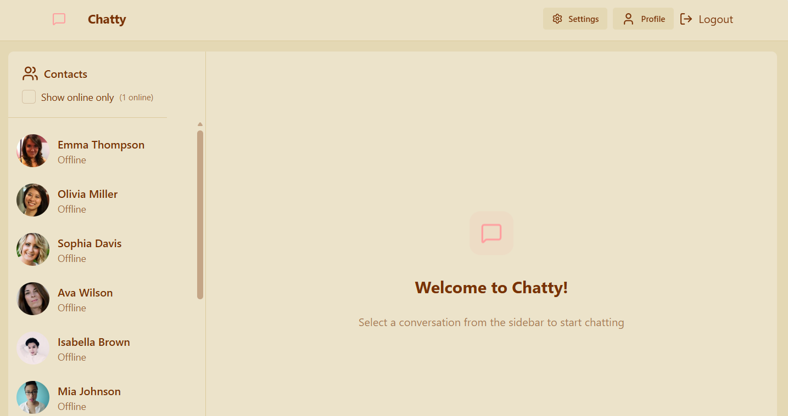
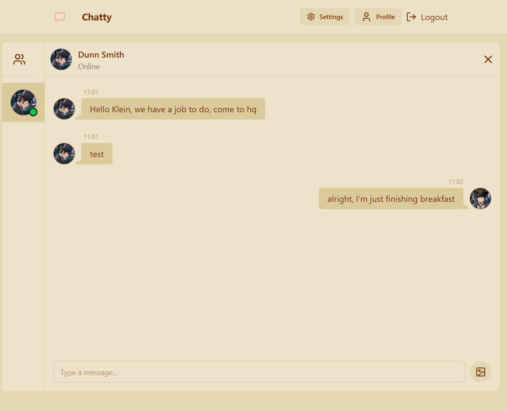
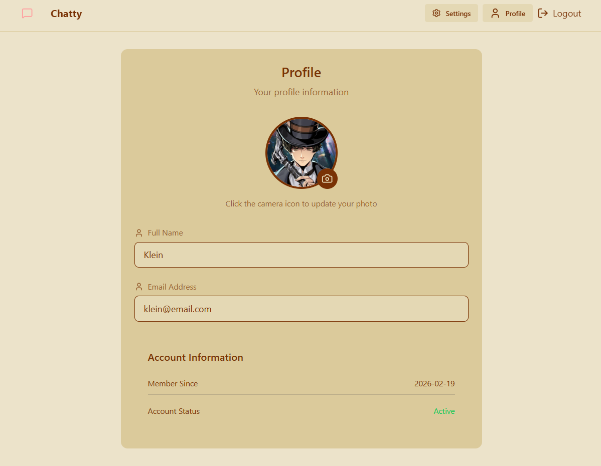
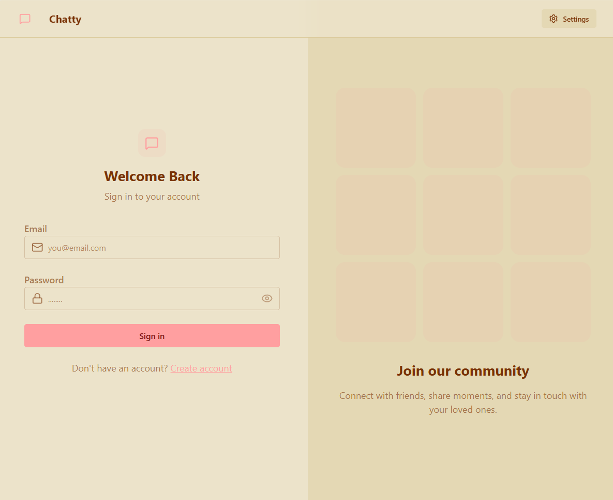

# Realtime Chat (Chatty)

Chatty is an instant chat message application that allows to communicate in real time and share images.

# Technologies 
- Typescript
- React.js
- Node.js
- Websockets
- MongoDB

# Services Used
- Github
- Cloudinary

# Libraries/Packages
- Hono.js
- Socket.io
- Turborepo
- Mongoose
- Zod
- Jsonwebtoken
- Axios
- Tailwind
- Zustand

# Getting Started

- Dependency
    - Docker+Docker Compose

- build project
    > /docker compose -f compose.prod.yaml build

- run project
    > /docker compose -f compose.prod.yaml up

- visit [http://localhost:8080](http://localhost:8080)

- for image uploading capability you need to setup Cloudinary env variables as shown in .env.example in the apps/backend folder, check out Cloudinary [documentation](https://cloudinary.com/documentation)

# Images
- Initial Page

- Chat Page 

- Profile Page

- Settings Page

- Login Page

# Authors

**Eduarte Paiva** 

Please follow github and join us!  
Thanks to visiting me and good coding!